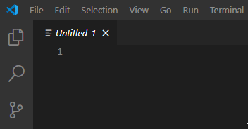

# Get started

## Install VS Code + Extension
1. Download and install [VS Code](https://code.visualstudio.com/). VS Code is like Notepad++ or Sublime Text but more powerful and almost as simple to use.
2. Install <a href="https://marketplace.visualstudio.com/items?itemName=tboby.cwtools-vscode" target="_blank">the extension</a>
  * 2.1 If on linux, possibly follow <a href="https://code.visualstudio.com/docs/setup/linux#_visual-studio-code-is-unable-to-watch-for-file-changes-in-this-large-workspace-error-enospc" target="_blank">these instructions</a> to increase the number of watched files.

## Use the extension

*Make backups of your mod files, use Git and commit frequently. Features like "Format document" can't always be easily undone.*

1. Open your mod folder. *Hint: VS Code opens whole projects unlike NP++ which just opens files*
  * Windows: "C:\Users\name\Paradox Interactive\Stellaris\mod\your-mods-name"
  * Linux:   "~/.local/share/Paradox Interactive/Stellaris/mod/your-mods-name"
  
2. Follow the prompts to select your vanilla folder
  * 2.1. Should step 2. not be successful go to File -> Preferences -> Settings  and search for "cwtools.cache" and set the game folder manually
3. Wait up to a minute for the extension to scan all your mods and find all errors
4. Edit files and watch syntax errors show up when you make mistakes

*Pro Tip: You can also open the vanilla game folder.*

Enjoy 💛